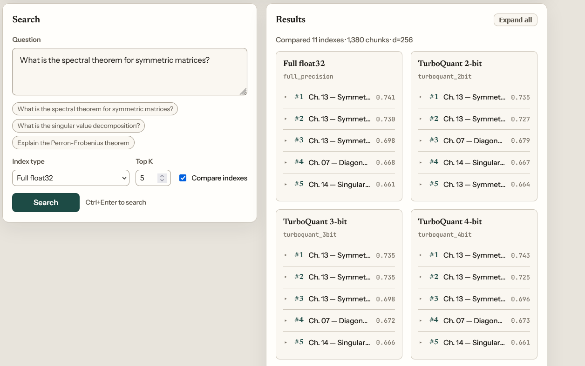
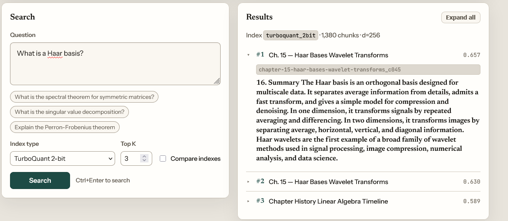

# Vector compression for high-dimensional data

A MATH 5110 (Applied Linear Algebra) course project. We survey five ways to shrink high-dimensional embedding vectors — Johnson–Lindenstrauss random projection, truncated SVD, 1-bit sign quantization, scalar quantization, and TurboQuant — implement each from scratch in NumPy, and test them on a real retrieval task: a RAG index built from the [MATH 5110 Quarto textbook](https://github.com/wanghemath/Book-AdvancedLinearAlgebraAI), scored against full-precision ground truth. The central finding is that preserving distances is not the same as preserving ranking.

These are **pedagogical** implementations of the underlying linear algebra, not a reproduction of LLM KV-cache inference.

## Read this first

- **[Paper — `docs/paper.pdf`](docs/paper.pdf)** — full write-up: theory → methods → results.
- **[Presentation — `docs/presentation.pdf`](docs/presentation.pdf)** — slide deck.

## Demo

A small web app (SvelteKit + FastAPI) searches the textbook index and compares compressed methods side by side.

Compare mode runs one query against every index at once, so you can watch the ranking drift as the bit budget shrinks:



Single-index mode shows the retrieved chunks in full for one method:



## Setup

Requires [uv](https://docs.astral.sh/uv/) and Python 3.12+. Set embedding credentials in `.env`:

**Azure OpenAI**:

```
AZURE_OPENAI_API_KEY=...
AZURE_OPENAI_ENDPOINT=https://YOUR-RESOURCE.openai.azure.com/
```

Then set `embeddings.provider: azure` and `embeddings.azure_deployment` (your deployment name) in `python/config.yaml`.

**Direct OpenAI**:

```
OPENAI_API_KEY=sk-...
```

Then set `embeddings.provider: openai` in `python/config.yaml`.

## Run

End-to-end pipeline (embeddings → compression study → figures):

```bash
uv sync
uv run python scripts/run_all.py
```

Search the RAG index from the command line:

```bash
uv run python scripts/search_class.py "What is the singular value decomposition?"
```

Web UI (SvelteKit + FastAPI — search and compare index sizes side by side). Requires [Bun](https://bun.sh):

```bash
uv sync --directory backend
cd frontend && bun install && cd ..
bun run dev   # API on :8010, UI on http://localhost:5173
```

## Repo layout


| Path                                 | Purpose                                 |
| -------------------------------------- | ----------------------------------------- |
| `python/src/vector_linalg/`          | Embeddings, compression, metrics, plots |
| `python/notebooks/application.ipynb` | Token + RAG walkthrough                 |
| `scripts/run_all.py`                 | End-to-end pipeline                     |
| `backend/`, `frontend/`              | FastAPI search API + SvelteKit UI       |
| `docs/paper.tex`, `docs/paper.pdf`   | Final academic paper (source + PDF)     |

Token vectors are embedded with the [OpenAI Embeddings API](https://platform.openai.com/docs/guides/embeddings) (`text-embedding-3-small`) and cached locally.
