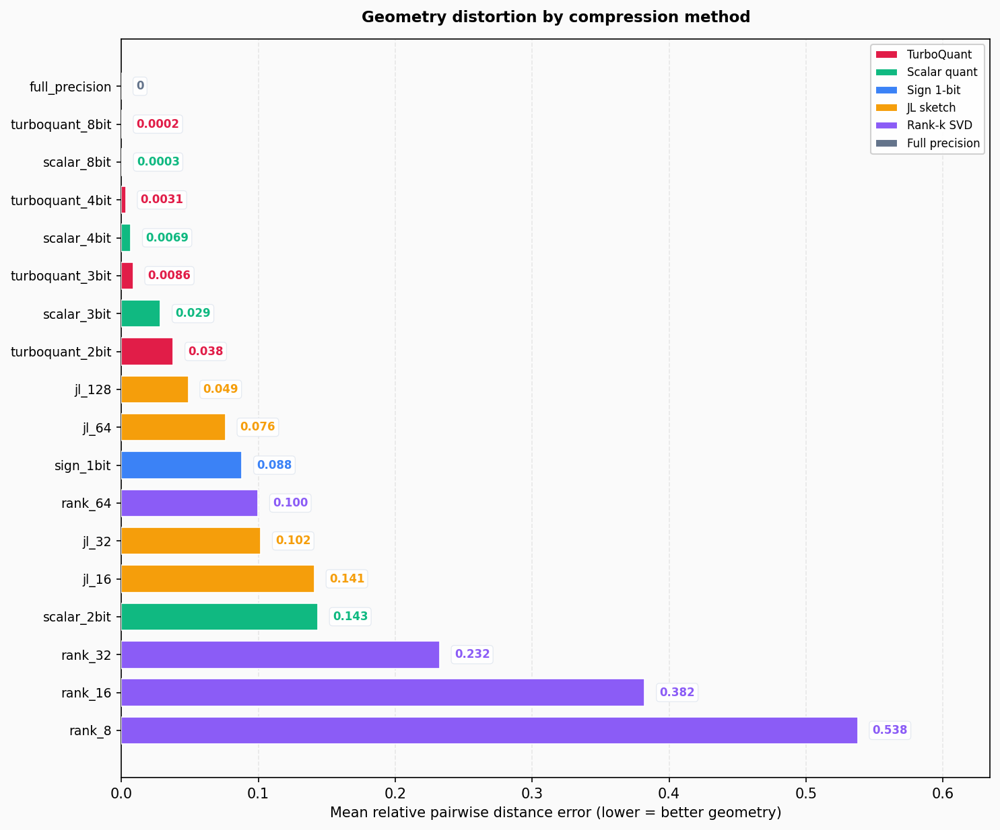
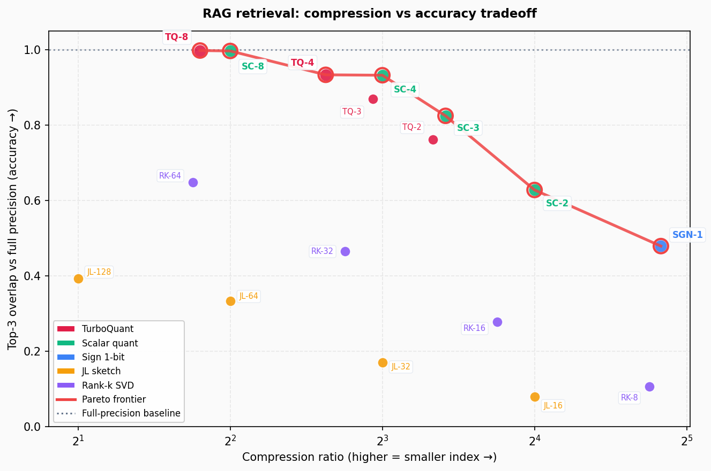
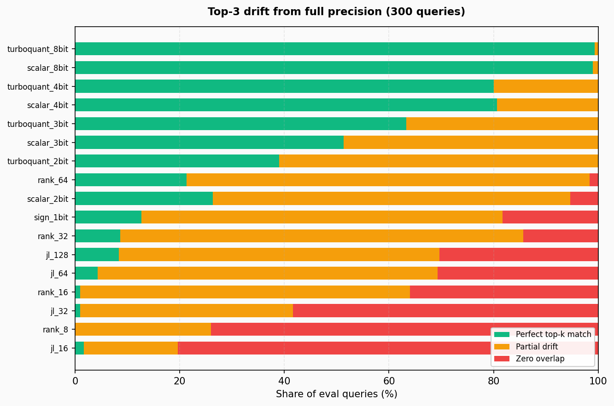

# Vector compression for embeddings and retrieval

**MATH 5110 — Applied linear algebra portfolio**

A full narrative from theory through implementation to measured results on textbook RAG. Figures used in the presentation are archived under [`docs/figures/`](figures/) so they stay versioned with the writeup even if `python/figures/` is regenerated.

**Regenerate numbers and plots:** `uv run python scripts/run_all.py`  
**Frozen headline metrics:** `python/data/presentation_results.json`  
**Live demo:** `bun run dev` (Svelte UI + FastAPI backend)

---

## Table of contents

1. [Motivation](#1-motivation)
2. [Theory: preserving geometry under compression](#2-theory-preserving-geometry-under-compression)
3. [Theory: TurboQuant’s two-stage pipeline](#3-theory-turboquants-two-stage-pipeline)
4. [What we built](#4-what-we-built)
5. [Evaluation design](#5-evaluation-design)
6. [Results](#6-results)
7. [Interpretation and honest conclusions](#7-interpretation-and-honest-conclusions)
8. [References](#8-references)

---

## 1. Motivation

Modern AI systems store enormous tables of **high-dimensional vectors**:

| System | What is stored | Why size matters |
|--------|----------------|------------------|
| **RAG index** | Document-chunk embeddings | Index size and query bandwidth scale with \(n \cdot d\) |
| **KV cache** | Attention key vectors per token | Memory grows with context length |
| **Embedding lookup** | One vector per token type | Table size grows with vocabulary and dimension |

For dimension \(d\) and \(n\) stored vectors, naive `float32` storage costs \(32\,n d\) bits. **Vector compression** asks: can we reduce bits per dimension while preserving the geometry that retrieval depends on — especially **inner products** and **nearest-neighbor ranking**?

Recent systems work ([TurboQuant](https://research.google/blog/turboquant-redefining-ai-efficiency-with-extreme-compression/), [PolarQuant](https://arxiv.org/abs/2502.02617), [Quantized JL](https://arxiv.org/abs/2406.03482)) combines classical random projections, spectral structure, and aggressive per-coordinate quantization. This project **implements simplified versions** of those ideas, measures them on real embeddings, and ships a searchable demo over Prof. Wang’s MATH 5110 course material.

We do **not** run transformer generation or KV-cache inference. The point is the **shared linear algebra** of compressed dot-product retrieval — the same math that powers RAG indexes and attention key lookup.

---

## 2. Theory: preserving geometry under compression

Throughout, vectors live in \(\mathbb{R}^d\). Retrieval scores a **query** \(q\) against **keys** \(k_1,\ldots,k_n\) via cosine similarity or dot product. Compression replaces full-precision keys (and sometimes queries) with a cheaper representation whose scores \(\hat{s}(q, k_i)\) approximate the true scores \(s(q, k_i)\).

### 2.1 Johnson–Lindenstrauss (JL) random projection

**Lemma (informal).** For \(n\) points in \(\mathbb{R}^d\) and distortion tolerance \(\varepsilon > 0\), there exists a linear map \(R \in \mathbb{R}^{k \times d}\) with
\[
k = O\!\left(\varepsilon^{-2} \log n\right)
\]
such that for all pairs \(u, v\) in the set,
\[
(1-\varepsilon)\,\|u-v\|^2 \;\le\; \|Ru - Rv\|^2 \;\le\; (1+\varepsilon)\,\|u-v\|^2.
\]

**Construction we use.** Gaussian random matrix with entries \(\mathcal{N}(0, 1/k)\). Sketch each key:
\[
y = Rx \in \mathbb{R}^k.
\]
Store sketched keys and the same matrix \(R\) so queries project as \(Rq\). Search in the lower-dimensional sketched space.

**Linear-algebra view.** \(R\) is a random linear operator; its singular values concentrate near 1 when \(k\) is large enough (Johnson–Lindenstrauss, 1984; constructive proofs via subgaussian rows, e.g. Dasgupta & Gupta, 2003).

**Limitation for retrieval.** JL guarantees **pairwise distance** preservation in expectation over \(R\). **Top-\(k\) ranking** is a global, order-sensitive objective. A method can have moderate distance error yet scramble which neighbors are closest — we see this clearly in our RAG numbers.

### 2.2 Spectral / rank-\(k\) truncation (PolarQuant analogy)

Stack \(n\) key vectors as rows of \(X \in \mathbb{R}^{n \times d}\). The thin SVD is
\[
X = U \Sigma V^\top, \qquad X \approx U_k \Sigma_k V_k^\top
\]
where \(U_k \Sigma_k V_k^\top\) keeps the top \(k\) singular directions.

**Interpretation.** Dominant right singular vectors \(V_k\) capture shared structure across the corpus (a low-dimensional “signal subspace”). Each vector is replaced by its projection onto \(\mathrm{span}(V_k)\).

**Polar intuition (PolarQuant).** PolarQuant (Zandieh et al., AISTATS 2026) works in polar coordinates: magnitude plus angular bins on the sphere. Rank-\(k\) SVD is a different tool, but the same idea applies — **separate coarse global structure from fine residual detail**. We use SVD truncation as a classroom-scale spectral baseline, not a full PolarQuant implementation.

**Storage accounting.** We amortize the shared basis \(V_k\) across all \(n\) vectors: bits per dimension \(\approx (kd + nk) \cdot 32 / (nd)\).

### 2.3 Sign quantization (1-bit, QJL-style)

Store one bit per coordinate: \(\mathrm{sign}(x_j) \in \{+1,-1\}\), plus the vector norm \(\|x\|\).

For a **full-precision query** \(q\), a standard inner-product estimator is
\[
\widehat{q^\top k} \;\approx\; \|k\| \cdot \frac{\mathrm{sign}(k)^\top q}{\sqrt{d}}.
\]

**Use case.** Extreme compression for dot-product scoring (attention keys, MIPS). **Quantized Johnson–Lindenstrauss (QJL)** (Zandieh et al., AAAI 2025) applies 1-bit quantization to **residuals** after a first compression stage — the key idea behind TurboQuant’s second pass.

### 2.4 Uniform scalar quantization

Per coordinate \(x_j\), map the corpus-wide range \([a_j, b_j]\) to \(2^b\) uniform levels:
\[
\hat{x}_j = a_j + \frac{\mathrm{round}\bigl((x_j - a_j)/(b_j-a_j) \cdot (2^b-1)\bigr)}{2^b-1}(b_j - a_j).
\]

**Properties.** Simple, direct control of **bits per dimension** (\(b\)). Error is biased and coordinate-aligned — without rotation, “important” directions aligned with axes can be clipped badly. This makes scalar quantization a **strong, honest baseline** at moderate bit budgets (4–8 bits).

### 2.5 Metrics that connect theory to engineering

| Metric | Definition | What it tests |
|--------|------------|---------------|
| **Mean relative distance error** | \(\mathbb{E}\bigl[| \|\hat{u}-\hat{v}\| - \|u-v\| | / \|u-v\|\bigr]\) on random pairs | Global geometry (JL-style) |
| **Overlap@\(k\)** | \(\| \mathrm{TopK}_{\mathrm{full}} \cap \mathrm{TopK}_{\mathrm{comp}} | / k\) | Retrieval ranking vs full-precision ground truth |
| **Bits per dimension** | Total index bits \(/ (n d)\) | Storage budget (includes shared metadata) |
| **Compression ratio** | \(32 / \text{bits per dim}\) relative to `float32` | Practical shrink factor |

**Important.** Low distance error does **not** imply high overlap@\(k\). Our JL baseline is the canonical example.

---

## 3. Theory: TurboQuant’s two-stage pipeline

[TurboQuant](https://arxiv.org/abs/2504.19874) (Zandieh, Mirrokni et al., ICLR 2026) targets **KV-cache key compression** with a pipeline we reproduce in simplified form:

```
full-precision key x
    → random rotation (flatten geometry)
    → stage-1 scalar quantization (b bits per coord in rotated space)
    → residual r = x - x̂₁
    → 1-bit sign quantization on r (QJL stage)
    → score with full-precision query on both parts
```

### 3.1 Stage 0: cheap random rotation

TurboQuant applies a random orthogonal transform so coordinates are **exchangeable** before aggressive scalar bins — analogous to spreading mass evenly across axes before per-coordinate quantization. We implement the lightweight variant from the paper’s spirit:

- random permutation \(\pi\) of coordinates,
- random Rademacher signs \(\sigma_j \in \{\pm 1\}\),

\[
\tilde{x} = (x_{\pi(1)}\sigma_1,\; \ldots,\; x_{\pi(d)}\sigma_d).
\]

Metadata cost is \(O(d)\) (permutation + signs), not \(O(d^2)\) for a dense orthogonal matrix.

### 3.2 Stage 1: scalar quantization in rotated space

In rotated space, per-dimension min/max ranges \([\ell_j, h_j]\) define uniform \(2^{b_1}\)-level quantizers. Reconstruct \(\hat{x}_1\) by inverse rotation. The label **“TQ-\(b\)”** in our plots means **\(b_1 = b\)** stage-1 bits per coordinate — **not** total storage. Total bits per dimension includes residual signs, norms, and shared metadata (typically \(\approx b + 1 + \text{overhead}\)).

### 3.3 Stage 2: QJL residual

\[
r = x - \hat{x}_1, \qquad \hat{x} = \hat{x}_1 + \frac{\|r\|}{\sqrt{d}}\,\mathrm{sign}(r)
\]
for reconstruction; scoring uses the **unquantized dot-product estimator** on the residual:
\[
\hat{s}(q, x) = \hat{x}_1^\top q + \frac{\|r\|}{\sqrt{d}}\,\mathrm{sign}(r)^\top q.
\]

**Why this helps.** Stage-1 scalar quant introduces **biased, correlated** error. The residual often still carries directional information aligned with the query. A 1-bit JL-style residual term adds an unbiased correction — this is TurboQuant’s main insight over plain scalar quantization at aggressive bit budgets.

### 3.4 Fair comparison: TQ-\(b\) vs SC-\(b\)

| Label | Meaning |
|-------|---------|
| **SC-\(b\)** (scalar) | \(b\) bits per coordinate in **original** coordinates |
| **TQ-\(b\)** (TurboQuant) | Stage-1 uses \(b\) bits per coordinate **after rotation**, plus 1-bit residual per coordinate |

Comparing **TQ-2 vs SC-2** is the apples-to-apples question: “same stage-1 aggressiveness, does the QJL residual help?” Comparing **TQ-2 vs SC-3** is **not** fair — SC-3 spends more bits in stage 1.

Total bits per dimension for TurboQuant exceeds the stage-1 label because of residual storage, e.g. TQ-2 \(\approx 3.2\) bits/dim vs SC-2 \(= 2.0\) bits/dim.

---

## 4. What we built

### 4.1 Repository structure

| Component | Location | Role |
|-----------|----------|------|
| Compression kernels | `python/src/vector_linalg/compression.py` | JL, rank-\(k\), sign, scalar, TurboQuant |
| RAG pipeline | `python/src/vector_linalg/rag.py` | Chunking, embedding, 300-query auto-eval |
| Figures | `python/src/vector_linalg/plots.py` | Distance error, compression frontier, drift |
| Orchestration | `scripts/run_all.py` | End-to-end regenerate |
| Backend API | `backend/` | Corpus search with method switcher |
| Frontend | `frontend/` | Live demo UI |

### 4.2 Data sources

**Token study (Part B).** ~230 word-piece tokens from OpenAI `text-embedding-3-small`, \(d = 256\). Measures recall@10 among token vectors — a controlled sandbox with many near-duplicate neighbors.

**Book RAG (Part C).** Prof. Wang’s MATH 5110 textbook (GitHub + Canvas PDF), chunked into **1,380 passages**, embedded with the same model. **300 evaluation queries** are auto-generated by stratified sampling over chunks (section titles, first sentences, TF-IDF phrases) so every part of the book is represented. Ground truth for each query is **top-3 cosine neighbors under full-precision** embeddings.

### 4.3 Implemented methods

| Method key | Theory |
|------------|--------|
| `full_precision` | Baseline |
| `jl_{16,32,64,128}` | Gaussian JL sketch to \(k\) dimensions |
| `rank_{8,16,32,64}` | SVD truncation |
| `sign_1bit` | Coordinate sign + norm |
| `scalar_{2,3,4,8}bit` | Uniform scalar quant |
| `turboquant_{2,3,4,8}bit` | Rotate → scalar \(b\) → QJL residual |

All methods share the same embedding matrix and random seed (`config.yaml`) for reproducibility.

### 4.4 Scoring at query time

- **JL:** project query with stored \(R\); cosine in sketched space.
- **Sign / scalar / rank-\(k\):** cosine on reconstructed or stored approximate keys.
- **TurboQuant:** `recon @ q + (res_norms * res_signs @ q) / sqrt(d)` with **full-precision** \(q\) — matching the paper’s query-side correction.

The live demo exposes the same methods through the API so qualitative behavior matches the benchmark.

---

## 5. Evaluation design

### 5.1 Distance distortion

Sample random pairs of token embeddings (or reconstructed approximations). Report mean **relative error** in Euclidean distance. This stress-tests global geometry independent of a fixed query set.

### 5.2 Overlap@\(k\) (RAG)

For each of 300 queries:

1. \(\mathrm{TopK}_{\mathrm{full}}\) = indices of top-\(k\) chunks by full-precision cosine.
2. \(\mathrm{TopK}_{\mathrm{comp}}\) = top-\(k\) under compressed scoring.
3. Overlap fraction \(= |\mathrm{TopK}_{\mathrm{full}} \cap \mathrm{TopK}_{\mathrm{comp}}| / k\).

We report the **mean overlap fraction** across queries (equivalent to recall@\(k\) when ground truth is the full-precision top-\(k\) set). \(k = 3\) for RAG; \(k = 10\) for the token study.

**Why overlap, not just MRR?** Set overlap is **rank-blind** within the top-\(k\) window — appropriate when the LLM sees any of the top passages, not only rank 1.

### 5.3 Compression frontier

Plot **mean overlap@\(k\)** vs **compression ratio** (or bits/dim). Pareto interpretation: upper-right is better (more accuracy, more compression). Methods that lie below another on **both** axes are dominated.

### 5.4 Drift diagnostics

For each compressed method, record queries where overlap \(< k\): which gold chunks were lost, which spurious chunks entered. Summarized in the drift figure — shows **where** compression fails, not only the aggregate rate.

---

## 6. Results

### 6.1 Distance distortion (mechanism)

Mean relative distance error on token pairs, sorted by error. Lower is better. TurboQuant variants cluster with moderate-error methods but **below** raw scalar at the same stage-1 label because rotation + residual correction reduce systematic bias.



**Reading the chart.** Rank-\(k\) and JL achieve moderate distance error but can still fail retrieval (next section). Scalar at 2 bits has high distance error; TurboQuant-2bit is substantially better. At 8 bits, scalar and TurboQuant both approach zero error.

### 6.2 RAG compression frontier (headline tradeoff)

300 queries, \(k = 3\), 1,380 chunks. X-axis: compression ratio vs `float32`. Y-axis: mean overlap@3 vs full-precision ground truth.



**RAG results table** (from `presentation_results.json`):

| Method | Overlap@3 | Bits/dim | Compression |
|--------|-----------|----------|-------------|
| Full precision | 100.0% | 32.0 | 1.0× |
| JL-128 | 39.2% | 16.0 | 2.0× |
| Rank-64 | 64.8% | 9.5 | 3.4× |
| Sign 1-bit | 47.9% | 1.1 | 28.4× |
| **SC-2** | 62.8% | 2.0 | 16.0× |
| **TQ-2** | **76.1%** | 3.2 | 10.1× |
| SC-3 | 82.4% | 3.0 | 10.7× |
| TQ-3 | 87.0% | 4.2 | 7.7× |
| SC-4 | 93.2% | 4.0 | 8.0× |
| TQ-4 | 93.3% | 5.2 | 6.2× |
| SC-8 | 99.7% | 8.0 | 4.0× |
| TQ-8 | 99.8% | 9.2 | 3.5× |

**Token study (recall@10)** — same methods, easier geometry:

| Method | Recall@10 | Bits/dim |
|--------|-----------|----------|
| SC-2 | 82.5% | 2.0 |
| TQ-2 | 87.0% | 3.4 |
| SC-3 | 90.7% | 3.0 |
| TQ-3 | 94.8% | 4.4 |
| SC-4 | 95.8% | 4.0 |
| TQ-4 | 97.2% | 5.4 |

### 6.3 Retrieval drift (where answers change)

Distribution of per-query overlap and examples of swapped chunks when compression changes the top-3 set.



At aggressive compression, failures concentrate on queries where several chunks have similar scores — small score noise reorders the top-3.

### 6.4 Index storage (RAG corpus)

| Method | Index size | Bits/dim |
|--------|------------|----------|
| Full precision | 1.41 MB | 32.0 |
| Sign 1-bit | 0.055 MB | 1.1 |
| SC-2 | 0.090 MB | 2.0 |
| TQ-2 | 0.148 MB | 3.2 |
| SC-4 | 0.179 MB | 4.0 |
| TQ-4 | 0.237 MB | 5.2 |

TurboQuant trades extra bytes for ranking quality at the same stage-1 label.

---

## 7. Interpretation and honest conclusions

### 7.1 What we confirmed

1. **JL distance theory \(\not\Rightarrow\) retrieval.** `jl_128` preserves distances reasonably (token relative error \(\approx 5\%\)) yet achieves only **39%** RAG overlap@3. For production retrieval, JL sketches need task-specific validation.

2. **TurboQuant wins the fair fight at aggressive stage-1 bits.** **TQ-2 vs SC-2:** 76% vs 63% overlap@3 — same stage-1 bit width, rotation + QJL residual matters. Token study shows the same pattern (87% vs 82.5% recall@10).

3. **Scalar is a strong baseline at 4–8 bits.** SC-4 and TQ-4 tie on overlap (~93%); SC-4 uses fewer bits (4.0 vs 5.2 bits/dim). At 8 bits both methods are effectively lossless on this corpus.

4. **Labels are not total bit budgets.** “TQ-2” \(\neq\) 2 bits/dim total. Always read the frontier on **both** axes.

### 7.2 What we did not claim

- We did not reproduce Llama KV-cache benchmarks or end-to-end generation quality.
- Our TurboQuant omits full PolarQuant grids and learned codebooks from the Google pipeline.
- Results are corpus-specific (one textbook, one embedding model, 300 auto queries).

### 7.3 When to use which method (practical guide)

| Goal | Suggestion from our data |
|------|--------------------------|
| Maximum compression, accept rank loss | Sign 1-bit or rank-8 |
| ~10× compression, best ranking | TurboQuant stage-1 = 2–3 bits |
| ~8× compression, simpler deploy | Scalar 4-bit (matches TQ-4 overlap, fewer bits) |
| Near-lossless | Scalar or TurboQuant 8-bit |

### 7.4 Connection to the course themes

The project exercises **SVD**, **random projections**, **orthonormal transforms**, and **quantization error analysis** on real data — not toy \(2 \times 2\) matrices. RAG is the application layer that makes retrieval quality measurable; the mathematical objects are the same ones that appear in KV-cache compression and embedding-table shrinkage.

---

## 8. References

1. Johnson, W. B., & Lindenstrauss, J. (1984). Extensions of Lipschitz maps into a Hilbert space. *Contemporary Mathematics*, 26, 189–206.

2. Dasgupta, S., & Gupta, A. (2003). An elementary proof of a theorem of Johnson and Lindenstrauss. *Random Structures & Algorithms*, 22(1), 60–65.

3. Lewis, P., et al. (2020). Retrieval-augmented generation for knowledge-intensive NLP tasks. *NeurIPS*.

4. Zandieh, A., et al. (2025). Quantized Johnson–Lindenstrauss transforms. *AAAI*. [arXiv:2406.03482](https://arxiv.org/abs/2406.03482)

5. Zandieh, A., et al. (2026). PolarQuant: Quantizing KV cache with polar coordinates. *AISTATS*. [arXiv:2502.02617](https://arxiv.org/abs/2502.02617)

6. Zandieh, A., Mirrokni, V., et al. (2026). TurboQuant: Turbocharging KV cache compression with polar and quantized Johnson–Lindenstrauss transforms. *ICLR*. [arXiv:2504.19874](https://arxiv.org/abs/2504.19874)

7. Google Research Blog (2026). [TurboQuant: Redefining AI efficiency with extreme compression](https://research.google/blog/turboquant-redefining-ai-efficiency-with-extreme-compression/).

8. OpenAI. [Embeddings guide](https://platform.openai.com/docs/guides/embeddings) — `text-embedding-3-small`, \(d = 256\).

---

*Shorter survey outline: [`SURVEY.md`](SURVEY.md). Slide-by-slide deck notes: [`SLIDES.md`](SLIDES.md).*
